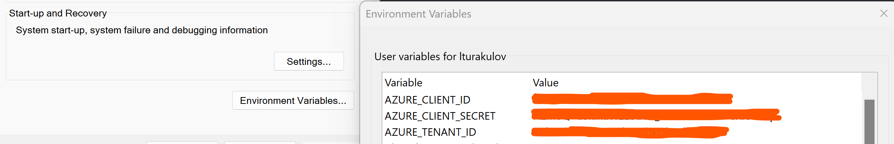

# Authenticating with Azure OpenAI models, using Entra ID (former Azure Active Directory).

Azure OpenAI service supports 2 authentication methods to access GPT-x, Embeddings, Whisper and DALL-E models:
- _using API key_, when you authenticate with your Azure OpenAI endpoint's API key
- _using Entra ID_, when you authenticate with a temporary access token.

While API keys are simpler and easier to use, some clients may prefer the use of Entra ID bearer tokens because of internal security requirements.

In this repo I'll demo the use of the latest openai Python package v1.x, that was released in November 2023. And, particularly, on how to use the new **azure_ad_token_provider** parameter of **AzureOpenAI** class.

To use the latest version of *openai* python package, you can upgrade it with the following pip command:
```
pip install --upgrade openai
```

## Table of contents:
- [Scenario 1: Authenticating with API Key](https://github.com/LazaUK/AOAI-EntraIDAuth-SDKv1/tree/main#scenario-1-authenticating-with-api-key)
- [Scenario 2: Authenticating with Entra ID - Interactive Login](https://github.com/LazaUK/AOAI-EntraIDAuth-SDKv1/tree/main#scenario-2-authenticating-with-entra-id---interactive-login)
- [Scenario 3: Authenticating with Entra ID - Service Principal](https://github.com/LazaUK/AOAI-EntraIDAuth-SDKv1/tree/main#scenario-3-authenticating-with-entra-id---service-principal)
- [Scenario 4: Authenticating with Entra ID - Managed Identity](https://github.com/LazaUK/AOAI-EntraIDAuth-SDKv1/tree/main#scenario-4-authenticating-with-entra-id---managed-identity)
- [Scenario 4a: Specifics of using Managed Identity with Azure Kubernetes Services (AKS)]()

## Scenario 1: Authenticating with API Key
1. To use API key authentication, assign API endpoint name, version and key, along with the Azure OpenAI deployment name to **OPENAI_API_BASE**, **OPENAI_API_VERSION**, **OPENAI_API_KEY** and **OPENAI_API_DEPLOY** environment variables.

2. Now you can instantiate AzureOpenAI client and pass environment variable values to the relevant parameters.
``` Python
client = AzureOpenAI(
    azure_endpoint = os.getenv("OPENAI_API_BASE"),
    api_key = os.getenv("OPENAI_API_KEY"),
    api_version = os.getenv("OPENAI_API_VERSION")
)
```
3. Calling Chat Completions API will pass your API key to Azure OpenAI endpoint.
``` Python
response = client.chat.completions.create(
    model = os.getenv("OPENAI_API_DEPLOY"), # model = "Azure OpenAI deployment name".
    messages = [
        {"role": "system", "content": "You are a friendly chatbot"},
        {"role": "user", "content": "Choose a random planet and describe it to me in 3 sentences."}
    ]
)
```
4. And it should generate relevant completion.
``` JSON
Neptune is the eighth and farthest known planet from the Sun in our solar system. It is a giant planet composed primarily of hydrogen and helium, with traces of methane, giving it a striking blue appearance. Neptune has a dynamic atmosphere with the fastest winds in the solar system, reaching speeds of over 1,100 miles per hour, and a series of dark spots caused by storm activities.
```

## Scenario 2: Authenticating with Entra ID - Interactive Login
>**Note**: Ensure that you have the "**Cognitive Service OpenAI User**" role assigned to yourself on the Azure OpenAI resource.
1. To use interactive authentication with Entra ID, import **InteractiveBrowserCredential** class **and get_bearer_token_provider** function from _azure.identity_ package and instantiate your token provider.
``` Python
token_provider = get_bearer_token_provider(
    InteractiveBrowserCredential(),
    "https://cognitiveservices.azure.com/.default"
)
```
2. Now you can instantiate AzureOpenAI client and set **azure_ad_token_provider** parameter to your token provider from Step 2.1 above.
``` Python
client = AzureOpenAI(
    azure_endpoint = os.getenv("OPENAI_API_BASE"),
    azure_ad_token_provider = token_provider,
    api_version = os.getenv("OPENAI_API_VERSION")
)
```
3. Calling Chat Completions API will open a new browser window for you to login with your Azure account.
``` Python
response = client.chat.completions.create(
    model = os.getenv("OPENAI_API_DEPLOY"), # model = "Azure OpenAI deployment name".
    messages = [
        {"role": "system", "content": "You are a friendly chatbot"},
        {"role": "user", "content": "Choose a random flower and describe it to me in 3 sentences."}
    ]
)
```
4. If authentication is successful, the called GPT model should generate relevant completion.
``` JSON
The sunflower, a vibrant echo of the summer sun, stands tall with its large, rough stem that hoists the bright yellow petals aloft. Each flower is actually a composite of hundreds of small florets that cluster together to form the eye-catching disk, circled by the flamboyant sun-like halo. This cheerful bloom not only follows the day's sun, performing a slow dance from east to west, but is also a symbol of loyalty and adoration.
```

## Scenario 3: Authenticating with Entra ID - Service Principal
>**Note**: Ensure that your Service Principal has the "**Cognitive Service OpenAI User**" role assigned to it on the Azure OpenAI resource.
1. To use authentication with the Entra ID Service Principal, import **EnvironmentCredential** class **and get_bearer_token_provider** function from _azure.identity_ package and instantiate your token provider.
``` Python
token_provider = get_bearer_token_provider(
    EnvironmentCredential(),
    "https://cognitiveservices.azure.com/.default"
)
```
2. Assign your Service Principal's details to **AZURE_TENANT_ID**, **AZURE_CLIENT_ID** and **AZURE_CLIENT_SECRET** environment variables.

3. Now you can instantiate AzureOpenAI client and set **azure_ad_token_provider** parameter to your token provider from Step 3.1 above.
``` Python
client = AzureOpenAI(
    azure_endpoint = os.getenv("OPENAI_API_BASE"),
    azure_ad_token_provider = token_provider,
    api_version = os.getenv("OPENAI_API_VERSION")
)
```
4. Calling Chat Completions API will pass your Service Principal's credentials to the Entra ID endpoint to request an access token.
``` Python
response = client.chat.completions.create(
    model = os.getenv("OPENAI_API_DEPLOY"), # model = "Azure OpenAI deployment name".
    messages = [
        {"role": "system", "content": "You are a friendly chatbot"},
        {"role": "user", "content": "Choose a random animal and describe it to me in 3 sentences."}
    ]
)
```
5. If authentication is successful, the called GPT model should generate relevant completion.
``` JSON
The animal I've chosen is the giraffe. Giraffes are the tallest mammals on Earth, their legs alone can be taller than most humans—about 6 feet. They have a distinctive spotted coat and a long neck which they use to reach leaves, fruits, and flowers high up in Acacia trees.
```

## Scenario 4: Authenticating with Entra ID - Managed Identity
>**Note**: This option can be used only with an Azure-based resource that supports the use of managed identities (MI), as described [here](https://learn.microsoft.com/en-us/azure/developer/python/sdk/authentication-azure-hosted-apps?tabs=azure-cli%2Cazure-app-service). Ensure, that your MI has the "**Cognitive Service OpenAI User**" role assigned to it on the Azure OpenAI resource.
1. Assign managed identity's client ID to **AZURE_MANAGED_IDENTITY_CLIENT_ID** environment variable.
2. Define Entra ID credentials with **ManagedIdentityCredential** class, that will require your MI's client ID.
``` Python
MI_credential = ManagedIdentityCredential(
    client_id = os.getenv("AZURE_MANAGED_IDENTITY_CLIENT_ID"),
)
```
3. You can instantiate your token provider now with the managed identity's credentials.
``` Python
token_provider = get_bearer_token_provider(
    MI_credential,
    "https://cognitiveservices.azure.com/.default"
)
```
4. Now you can instantiate AzureOpenAI client and set **azure_ad_token_provider** parameter to your token provider from Step 4.3 above.
``` Python
client = AzureOpenAI(
    azure_endpoint = os.getenv("OPENAI_API_BASE"),
    azure_ad_token_provider = token_provider,
    api_version = os.getenv("OPENAI_API_VERSION")
)
```
5. Calling Chat Completions API will pass your MI's credentials to the Entra ID endpoint to request an access token.
``` Python
response = client.chat.completions.create(
    model = os.getenv("OPENAI_API_DEPLOY"), # model = "Azure OpenAI deployment name".
    messages = [
        {"role": "system", "content": "You are a friendly chatbot"},
        {"role": "user", "content": "Choose a random animal and describe it to me in 3 sentences."}
    ]
)
```
6. If authentication is successful, the called GPT model should generate relevant completion.
``` JSON
The Atlantic Puffin, also known as the "sea parrot," is a charming seabird notable for its colorful beak and matching orange legs. These compact birds are excellent swimmers, using their wings to 'fly' underwater while hunting for fish. Puffins are social creatures, nesting in large colonies on cliffs and spending most of their lives at sea, only coming to land to breed.
```

### Scenario 4a: Specifics of using Managed Identity with Azure Kubernetes Services (AKS)
If your application runs on AKS and requires the use of a managed identitiy, then you need to perform some additional configuration steps as described [here](https://learn.microsoft.com/en-us/azure/aks/open-ai-secure-access-quickstart):
- Enable Microsoft Entra Workload ID and OIDC (OpenID Connect) Issuer Endpoint features on an AKS cluster, with ```az aks update --resource-group <YOUR_AKS_RESOURCE_GROUP> --name <YOUR_AKS_CLUSTER_NAME> --enable-workload-identity --enable-oidc-issuer```;
- Create a Microsoft Entra ID federated credential, so that your AKS workload can exchange its service account's token for an Entra ID managed identity's token;
- Create a Service Account in AKS that will contact **azure.workload.identity/client-id** annotation, pointing to MI's client ID as described [here](https://learn.microsoft.com/en-us/azure/aks/workload-identity-overview?tabs=python#service-account-annotations);
- Update your AKS pod with a label **azure.workload.identity/use: "true"**, so that it can use workload identity as described [here](https://learn.microsoft.com/en-us/azure/aks/workload-identity-overview?tabs=python#pod-labels).

>**Credits**: Thank you to Mick Vleeshouwer for his suggestion about the use of Managed Identity and sharing [notebook details with the earlier API implementation](https://github.com/iMicknl/connect-AML-to-Azure-OpenAI/tree/main/notebooks).
